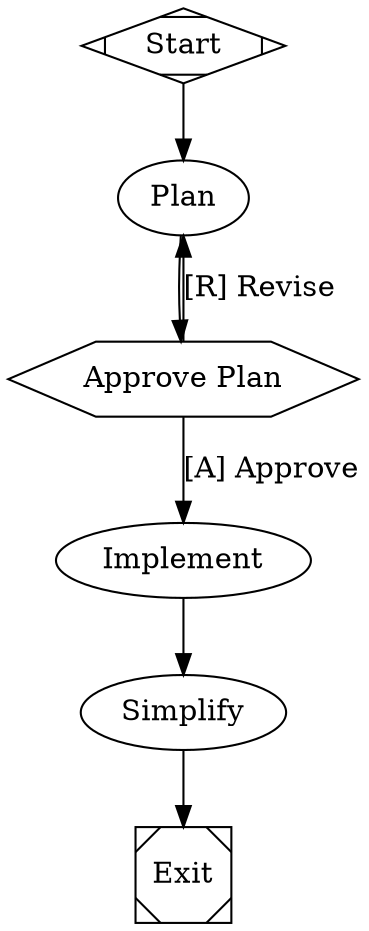

<div align="left" id="top">
<a href="https://arc.dev"></a>
</div>

## The software factory for small teams of expert engineers

Arc replaces the prompt-wait-review loop with version-controlled workflow graphs that orchestrate AI agents, shell commands, and human decisions into repeatable, long-horizon coding processes.

Define workflows in Graphviz DOT, route tasks to the right model with CSS-like stylesheets, and let the engine handle orchestration, parallelism, checkpointing, and verification -- all from a single Rust binary.

[](LICENSE.md)
[](https://arc.dev)

---

## Table of Contents

- [Key Features](#key-features)
- [Quick Start](#quick-start)
- [Example Workflow](#example-workflow)
- [Supported Models](#supported-models)
- [Architecture](#architecture)
- [System Requirements](#system-requirements)
- [Help or Feedback](#help-or-feedback)
- [Contributing](#contributing)
- [License](#license)

---

## Key Features

### What Arc Does

|     | Feature                    | Description                                                                                |
| --- | -------------------------- | ------------------------------------------------------------------------------------------ |
| :robot: | Multi-model orchestration   | Route tasks to the right model per node -- cheap for boilerplate, frontier for hard reasoning |
| :diamond_shape_with_a_dot_inside: | Declarative workflows       | Define pipelines in Graphviz DOT -- diffable, reviewable, composable                        |
| :raised_hand: | Human-in-the-loop          | Approval gates, interviews, and real-time steering let you intervene at the right moments   |
| :arrows_counterclockwise: | Checkpoint and resume       | Git-native checkpointing after every stage -- inspect, revert, or fork from any point        |
| :shield: | Adaptive verification      | Combine LLM-as-judge, test suites, and human review into quality gates                      |
| :bar_chart: | Full observability          | Every tool call, agent turn, and decision point captured in a unified event stream           |

### How Arc Does It

|     | Feature                 | Description                                                                              |
| --- | ----------------------- | ---------------------------------------------------------------------------------------- |
| :art: | Model stylesheets        | CSS-like selectors (`*`, `.class`, `#id`) assign models, providers, and reasoning effort |
| :deciduous_tree: | Git-native checkpoints   | Every stage commits to a branch -- resume interrupted runs exactly where they left off    |
| :package: | Sandbox isolation        | Run agent tools in local, Docker, Daytona cloud VMs, or exe.dev ephemeral VMs            |
| :electric_plug: | MCP integration          | Extend agents with any Model Context Protocol server (Playwright, databases, APIs)       |
| :repeat: | Loops and fan-out        | Implement-test-fix cycles, parallel code reviews, and ensemble multi-provider patterns   |
| :crab: | Written in Rust          | Single compiled binary with minimal dependencies -- no Python runtime, no npm install     |
| :gear: | CLI and API modes        | `arc run` for local dev, `arc serve` for production with a React web UI                  |

Read the full [documentation](https://arc.dev) for details.

---

## Quick Start

> [!WARNING]
> Arc is in private research preview. Contact [bryan@qlty.sh](mailto:bryan@qlty.sh) if you're interested in trying it.

### Prerequisites

- [Rust](https://rustup.rs/) (latest stable)
- At least one LLM API key (`ANTHROPIC_API_KEY`, `OPENAI_API_KEY`, or `GEMINI_API_KEY`)

### Clone and build

```bash
git clone https://github.com/qltysh/arc.git
cd arc
cargo build --release
```

### Configure API keys

```bash
cp .env.example .env
# Edit .env and add at least one provider key
```

### Run the setup wizard

```bash
./target/release/arc install
```

### Verify your installation

```bash
./target/release/arc doctor --live
```

### Run your first workflow

```bash
./target/release/arc run docs-internal/demo/01-hello.dot
```

Or try a multi-step workflow with a human approval gate:

```bash
./target/release/arc run docs-internal/demo/10-plan-implement.dot
```

---

## Example Workflow

A plan-approve-implement workflow where a human reviews the plan before the agent writes code:



### Node types at a glance

| Shape            | Type        | What it does                                     |
| ---------------- | ----------- | ------------------------------------------------ |
| `Mdiamond`       | Start       | Workflow entry point                             |
| `Msquare`        | Exit        | Workflow terminal                                |
| `box` (default)  | Agent       | Multi-turn LLM with tool access                 |
| `tab`            | Prompt      | Single LLM call, no tools                        |
| `parallelogram`  | Command     | Runs a shell script                              |
| `hexagon`        | Human gate  | Pauses for human input                           |
| `diamond`        | Conditional | Routes based on conditions                       |
| `component`      | Parallel    | Fans out to concurrent branches                  |
| `tripleoctagon`  | Merge       | Collects parallel branch results                 |

### Multi-model routing with stylesheets

```dot
graph [
    model_stylesheet="
        *        { llm_model: claude-haiku-4-5; reasoning_effort: low; }
        .coding  { llm_model: claude-sonnet-4-5; reasoning_effort: high; }
        #review  { llm_model: gemini-3.1-pro-preview; llm_provider: gemini; }
    "
]
```

Selectors follow CSS specificity: `*` (0) < `shape` (1) < `.class` (2) < `#id` (3).

---

## Supported Models

| Model                        | Provider   | Aliases             |
| ---------------------------- | ---------- | ------------------- |
| `claude-opus-4-6`            | Anthropic  | `opus`              |
| `claude-sonnet-4-5`          | Anthropic  | `sonnet`            |
| `claude-haiku-4-5`           | Anthropic  | `haiku`             |
| `gpt-5.2`                    | OpenAI     | `gpt5`              |
| `gpt-5.3-codex`              | OpenAI     | `codex`             |
| `gpt-5.4`                    | OpenAI     | `gpt54`             |
| `gemini-3.1-pro-preview`     | Gemini     | `gemini-pro`        |
| `gemini-3-flash-preview`     | Gemini     | `gemini-flash`      |
| `kimi-k2.5`                  | Kimi       | `kimi`              |
| `glm-4.7`                    | Zai        | `glm`               |
| `minimax-m2.5`               | MiniMax    | `minimax`           |
| `mercury-2`                  | Inception  | `mercury`           |

Run `arc model list` for the full catalog. Provider fallback chains are configurable per-run.

---

## Architecture

Arc provides two interfaces backed by the same workflow engine:

| Feature              | CLI mode (`arc run`)             | API mode (`arc serve`)             |
| -------------------- | -------------------------------- | ---------------------------------- |
| Execution            | Synchronous, single run          | Async, queued with scheduler       |
| Human-in-the-loop    | Terminal prompts                 | HTTP endpoints + web UI            |
| Events               | Printed to stderr                | SSE stream                         |
| Concurrency          | One run per process              | Configurable (default 5)           |
| Best for             | Development, one-off runs        | Production, integrations           |

### Rust crates

| Crate            | Purpose                                                           |
| ---------------- | ----------------------------------------------------------------- |
| `arc-cli`        | CLI entry point (`run`, `exec`, `serve`, `doctor`, `install`)     |
| `arc-workflows`  | Core workflow engine -- DOT parsing, stage execution, checkpoints |
| `arc-agent`      | AI coding agent with tool use (Bash, Read, Write, Edit, Grep)     |
| `arc-api`        | Axum HTTP server with SSE event streaming                         |
| `arc-llm`        | Unified LLM client -- Anthropic, OpenAI, Gemini, and more         |
| `arc-types`      | Auto-generated types from OpenAPI spec                            |
| `arc-github`     | GitHub App auth, PR creation, checkpoint pushing                  |
| `arc-db`         | SQLite with WAL mode and schema migrations                        |
| `arc-mcp`        | Model Context Protocol client/server                              |

### TypeScript

| Package              | Purpose                                              |
| -------------------- | ---------------------------------------------------- |
| `apps/arc-web`       | React 19 + React Router + Vite + Tailwind frontend   |
| `arc-api-client`     | Auto-generated TypeScript client from OpenAPI spec    |

---

## System Requirements

- **macOS or Linux** (x86_64 or ARM)
- **Rust** (latest stable) for building from source
- **At least one LLM provider API key** (Anthropic, OpenAI, or Gemini)
- **Git** (for checkpoint and resume)
- **Docker** (optional, for Docker sandbox mode)

---

## Help or Feedback

- Read the [documentation](https://arc.dev)
- [Bug reports](https://github.com/qltysh/arc/issues) via GitHub Issues
- [Feature requests](https://github.com/qltysh/arc/issues) via GitHub Issues
- Email [bryan@qlty.sh](mailto:bryan@qlty.sh) for access or questions

---

## Contributing

### Developing the CLI

Arc requires a working [Rust toolchain](https://rustup.rs/):

```bash
git clone https://github.com/qltysh/arc.git
cd arc
cargo build --workspace
cargo test --workspace
```

### Developing the web UI

```bash
cd apps/arc-web
bun install
bun run dev
```

### Useful commands

| Command                                       | Description                           |
| --------------------------------------------- | ------------------------------------- |
| `cargo build --workspace`                     | Build all crates                      |
| `cargo test --workspace`                      | Run all tests                         |
| `cargo test -p arc-api`                       | Test a single crate                   |
| `cargo fmt --check --all`                     | Check formatting                      |
| `cargo clippy --workspace -- -D warnings`     | Lint                                  |
| `cd apps/arc-web && bun run typecheck`        | Type check the frontend               |

---

## License

Arc is licensed under the [MIT License](LICENSE.md).
