[DOS](https://github.com/anthony-chaudhary/dos-kernel) (the Dispatch Operating System) is a small, deterministic trust substrate for fleets of autonomous agents — "the part that doesn't believe the agents." It ships an [MCP](/agents/mcp) server (`dos-mcp`) that exposes a handful of read-only verification syscalls. Wire it into a workflow and your agents can confirm that a claim is actually true from **git evidence**, rather than from another model's say-so.

This is complementary to Fabro's existing verification rungs. A `script` node running `cargo test` checks behavior; an LLM-as-judge node (see [Definition of Done](/examples/definition-of-done)) checks judgment. DOS adds a third rung that neither covers: it checks whether a commit's *claim* matches its own *diff*, and whether a phase *actually shipped* by git ancestry — author-neutral, with no model in the loop. When an agent reports "done," DOS answers from artifacts the agent could not forge.

## Why a git-evidence gate

Agents narrate their own progress, and a verification node that re-reads the code is still a model forming a judgment — consistency, not grounding. DOS's verdicts come from non-forgeable sources:

- A commit subject (`fix: handle null user`) is whatever the agent typed. The files the commit *touched* are what git recorded. `dos_commit_audit` compares the two and flags a `fix:` that changed only a README, an `--allow-empty "shipped"`, or a "tests pass" commit that deleted the assertions.
- A "phase X is done" claim is a sentence. Whether a ship-stamped commit for that phase is an ancestor of `HEAD` is a fact. `dos_verify` answers from that ancestry, and reports `source: "none"` when there is no positive evidence either way — it never upgrades a thin signal into a strong one.

Neither tool judges whether the code is *correct* — that is what `cargo test` and review are for. They judge whether the claimed *kind of change* actually happened.

## Setup

DOS runs as a stdio MCP server. It needs Python 3.11+ on the host (or in the sandbox) that runs the agent session.

Zero-install with [uv](https://docs.astral.sh/uv/):

```bash
uvx --from 'dos-kernel[mcp]' dos-kernel --help
```

Or install it:

```bash
pip install 'dos-kernel[mcp]'
dos-mcp   # serves over stdio; this is what Fabro launches
```

<Note>
The distribution name is `dos-kernel`. The bare `dos` package on PyPI is an unrelated project — install `dos-kernel`, not `dos`. The `[mcp]` extra adds the MCP server framework; the core kernel stays near-stdlib.
</Note>

## Configure the MCP server

Add DOS as an [MCP server](/agents/mcp#agent-mcp-configuration) for your workflow's agents. The server name (`dos`) becomes the prefix in qualified tool names (`mcp__dos__dos_verify`):

```toml title="run.toml"
[run.agent.mcps.dos]
type = "stdio"
command = ["uvx", "--from", "dos-kernel[mcp]", "dos-kernel"]
startup_timeout = "30s"
tool_timeout = "60s"
```

If you installed the package on the host instead, point `command` at the console script:

```toml title="run.toml"
[run.agent.mcps.dos]
type = "stdio"
command = ["dos-mcp"]
startup_timeout = "15s"
tool_timeout = "60s"
```

By default every DOS tool operates on the agent's current working directory — the run's repository. To serve a different repo, set `DISPATCH_WORKSPACE`; an individual tool call can still override it with a `workspace` argument.

```toml title="run.toml"
[run.agent.mcps.dos.env]
DISPATCH_WORKSPACE = "/workspace"
```

After startup, the agent sees the DOS tools alongside its built-in tools:

| Tool | What it answers |
|---|---|
| `mcp__dos__dos_commit_audit` | *Does a commit's claim match its diff?* Returns `verdict` (`OK` / `CLAIM_UNWITNESSED` / `ABSTAIN`) and `witness` (`diff-witnessed` / `subject-only`). Needs no plan — works on any commit in any git repo. |
| `mcp__dos__dos_verify` | *Did `(plan, phase)` actually ship?* Returns `shipped` and `source` (`registry` / `grep` / `none`) so a thin answer can't pose as a strong one. Works against a bare git repo with no plan. |
| `mcp__dos__dos_arbitrate` | *May this worker take this lane right now?* A pure file-tree disjointness check — refuses when two workers' file sets would collide. Useful for [parallel stages](/workflows/stages-and-nodes). |
| `mcp__dos__dos_refuse_reasons` / `mcp__dos__dos_check_reason` | The closed vocabulary of structured refusal reasons, and a membership check — so an agent declines with a verifiable reason instead of free-text. |

Every workspace-scoped tool also honors a `dos.toml` in the served repo if one exists (its lane taxonomy, ship-stamp grammar, and refusal vocabulary), but none is required — DOS falls back to generic defaults.

## How it works

When the agent calls a DOS tool, Fabro routes it to the stdio server, which adjudicates against git and returns the kernel's verdict plus an `interpretation` field — a one-line "what this means for your next action." For example, auditing a `fix:`-subject commit whose diff touched only a README returns:

```json
{
  "sha": "0dbe7f4",
  "verdict": "CLAIM_UNWITNESSED",
  "claim_kind": "code_effect",
  "witness": "subject-only",
  "reason": "code-effect claim but the diff touches no SOURCE file (only: README.md) — the claim rests on the subject text",
  "interpretation": "CLAIM UNWITNESSED — this commit's message claims something its own diff does not show. Before you report this as done, either make the change the message claims or rewrite the message to match what the diff actually did."
}
```

A clean commit returns `verdict: "OK"`, `witness: "diff-witnessed"`. You can act on the verdict either in an agent node (the agent reads it and routes) or, since the same syscalls are a CLI, in a deterministic `script` node.

## Example workflow: a trust gate after implementation

This workflow implements a change, commits it, then runs a **git-evidence trust gate** before exit. The gate is not another LLM reviewing the diff — it asks DOS whether the commit's claim is witnessed by what it actually touched. If the verdict is `CLAIM_UNWITNESSED`, the run loops back to fix the gap instead of declaring a hollow success.

```dot title="trust-gate.fabro"
digraph TrustGate {
    graph [
        goal="Implement the change described in the goal, commit it, and pass the DOS trust gate",
        model_stylesheet="* { model: claude-sonnet-4-6; }"
    ]
    rankdir=LR

    start [shape=Mdiamond, label="Start"]
    exit  [shape=Msquare, label="Exit"]

    implement [
        label="Implement & Commit",
        prompt="Implement the change described in the goal. Then stage your edits and create a commit whose subject accurately describes what you changed."
    ]

    trust_gate [
        label="DOS Trust Gate",
        prompt="Call mcp__dos__dos_commit_audit with ref=\"HEAD\" to check whether the last commit's claim is witnessed by its diff.

If the verdict is \"OK\", set preferred_next_label to \"Verified\".
If the verdict is \"CLAIM_UNWITNESSED\", set preferred_next_label to \"Unwitnessed\" and report exactly which claim was not backed by a touched file."
    ]

    fix [
        label="Close the gap",
        prompt="The DOS trust gate found the commit's claim was not witnessed by its diff. Either make the implementation actually match the commit's claim, or amend the commit subject to describe what really changed. Then re-commit."
    ]

    start -> implement -> trust_gate
    trust_gate -> exit [label="Verified",   condition="preferred_label=Verified"]
    trust_gate -> fix  [label="Unwitnessed", condition="preferred_label=Unwitnessed"]
    fix -> trust_gate
}
```



### Deterministic variant

Because every DOS tool is also a CLI verb, you can run the same gate in a `script` node with no agent in the loop. This is the strongest form — the decision is a process exit code, not a model's reading:

```dot title="trust-gate-script.fabro"
trust_gate [
    label="DOS Trust Gate",
    shape=parallelogram,
    script="uvx --from 'dos-kernel' dos commit-audit --workspace . HEAD",
    timeout="60s"
]

trust_gate -> exit [label="Witnessed", condition="outcome=succeeded"]
trust_gate -> fix  [label="Unwitnessed"]
```

`dos commit-audit` exits non-zero when the commit's claim is unwitnessed, so the `outcome=succeeded` edge is the clean path and the fallback edge handles a failed audit.

## For plan-driven repositories

If your repo organizes work as numbered phase documents with ship-stamped commits, `dos_verify` closes the loop a workflow opens. Instead of trusting a node that says "phase 3 is done," a later node asks DOS:

```
mcp__dos__dos_verify(plan="AUTH", phase="AUTH3")
```

It answers `shipped: true` only when a ship-stamped commit for that phase is an ancestor of `HEAD`, and `source: "none"` when there is no evidence — which a fix loop can route on exactly like the trust gate above. Point `DISPATCH_WORKSPACE` at the repo and DOS reads its `dos.toml` ship-stamp grammar; with no config it falls back to a generic grep over commit subjects.

## Troubleshooting

**The `dos` tools never appear** — A server that fails to start is logged and skipped; the session continues with the remaining tools. Confirm the launch command runs on the host: `uvx --from 'dos-kernel[mcp]' dos-kernel --help`, or `dos-mcp --help` if you installed it. Raise `startup_timeout` if `uvx` is resolving the package for the first time.

**`ModuleNotFoundError: mcp`** — The MCP server framework lives in the `[mcp]` extra. Install `dos-kernel[mcp]`, not bare `dos-kernel`.

**`verdict: "ABSTAIN"`** — DOS could not classify the commit's claim (for example, an empty or purely mechanical commit). Abstain is honest: it is not a pass and not a fail. Treat it as "no evidence either way."

**Every audit returns `OK` but you expected a catch** — `dos_commit_audit` grades whether the claimed *kind* of change happened, not whether the code is correct. A commit that touches a source file to back a code claim is `diff-witnessed` even if the logic is wrong. Pair it with `cargo test` and review for correctness.

## Further reading

<Columns cols={2}>
  <Card title="MCP" icon="plug" href="/agents/mcp">
    How Fabro connects agents to external MCP tool servers.
  </Card>
  <Card title="Definition of Done" icon="clipboard-check" href="/examples/definition-of-done">
    The LLM-as-judge audit pattern that DOS's git-evidence gate complements.
  </Card>
  <Card title="Failure Handling" icon="rotate" href="/execution/failures">
    Retries, fix loops, and routing on node outcomes.
  </Card>
  <Card title="DOS kernel" icon="github" href="https://github.com/anthony-chaudhary/dos-kernel">
    The trust substrate, its syscalls, and the `dos-mcp` server.
  </Card>
</Columns>
