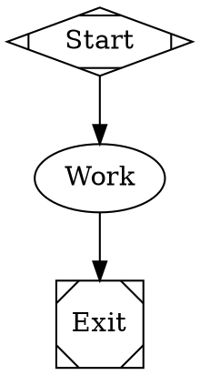

[OpenRouter](https://openrouter.ai) is an OpenAI-compatible gateway that proxies many model providers behind one API and one billing account. Fabro includes a disabled `openrouter` provider entry with a curated catalog of 17 models so you can opt in from `settings.toml` without changing Fabro code.

## Prerequisites

- An OpenRouter account
- An OpenRouter API key from [openrouter.ai/keys](https://openrouter.ai/keys)

## Enable the provider

Add the provider override to `~/.fabro/settings.toml`:

```toml title="settings.toml"
_version = 1

[llm.providers.openrouter]
enabled = true
```

That's the entire configuration — Fabro ships the model catalog, base URL, and attribution headers for you.

## Data handling

Requests sent through OpenRouter pass through their infrastructure before reaching the underlying model. Prompt content, completions, and metadata are subject to OpenRouter's logging, moderation, and data-retention policies — review them at [openrouter.ai/docs/features/privacy-and-logging](https://openrouter.ai/docs/features/privacy-and-logging) before sending sensitive prompts. You can also use OpenRouter's per-request privacy controls (`provider.data_collection` and provider routing filters) via the `provider_options.openrouter` field described below.

## Attribution (optional, opt-in)

OpenRouter recognizes two attribution headers — `HTTP-Referer` (your site URL) and `X-Title` (your app name) — that surface your install on OpenRouter's public leaderboard. Fabro does NOT send these by default, so self-hosted installations stay anonymous. To opt in, add them to your settings:

```toml title="settings.toml"
[llm.providers.openrouter.extra_headers]
"HTTP-Referer" = { literal = "https://your-site.example" }
"X-Title" = { literal = "Your App" }
```

## Configure credentials

For server-backed runs, store `OPENROUTER_API_KEY` in the Fabro server vault:

```bash
fabro provider login openrouter
```

Or via the generic secret command:

```bash
fabro secret set OPENROUTER_API_KEY sk-or-v1-...
```

Standalone local SDK/CLI runs can use an env-backed credential source:

```bash
export OPENROUTER_API_KEY=sk-or-v1-...
```

## Included models

The 17 models below ship with the provider. Use the Fabro model ID (left column) in workflows or on the CLI; Fabro sends OpenRouter's slug (right column) over the wire.

| Fabro model ID | OpenRouter slug |
| --- | --- |
| `anthropic/claude-opus-4-7` | `anthropic/claude-opus-4.7` |
| `anthropic/claude-sonnet-4-6` | `anthropic/claude-sonnet-4.6` |
| `anthropic/claude-haiku-4-5` | `anthropic/claude-haiku-4.5` |
| `openai/gpt-5.4` | `openai/gpt-5.4` |
| `openai/gpt-5.5` | `openai/gpt-5.5` |
| `google/gemini-3.1-pro-preview` | `google/gemini-3.1-pro-preview` |
| `google/gemini-3.5-flash` | `google/gemini-3.5-flash` |
| `xiaomi/mimo-v2.5-pro` | `xiaomi/mimo-v2.5-pro` |
| `minimax/minimax-m2.7` | `minimax/minimax-m2.7` |
| `deepseek/deepseek-v4-pro` | `deepseek/deepseek-v4-pro` |
| `deepseek/deepseek-v4-flash` | `deepseek/deepseek-v4-flash` |
| `moonshotai/kimi-k2.6` | `moonshotai/kimi-k2.6` |
| `qwen/qwen3-coder` | `qwen/qwen3-coder` |
| `qwen/qwen3.6-flash` | `qwen/qwen3.6-flash` |
| `z-ai/glm-4.6` | `z-ai/glm-4.6` |
| `nvidia/nemotron-3-super-120b-a12b` | `nvidia/nemotron-3-super-120b-a12b` |
| `mistralai/devstral-2512` | `mistralai/devstral-2512` |

The default model is `anthropic/claude-sonnet-4-6`. The small default (used for utility tasks like generated run titles) is `anthropic/claude-haiku-4-5`.

## Use OpenRouter models

```bash
fabro model list --provider openrouter
fabro model test --model anthropic/claude-sonnet-4-6
fabro run workflow.fabro --model deepseek/deepseek-v4-flash
```

In workflow stylesheets:



## Provider routing (via API or SDK)

OpenRouter accepts top-level request fields that aren't part of the OpenAI Chat Completions schema — `provider` (routing preferences), `models` (fallback list), `transforms`, `plugins`. Fabro forwards these through the `provider_options.openrouter` field on the request body when calling `POST /api/v1/completions` directly or constructing a `Request` via the Rust/TypeScript SDK:

```json
// POST /api/v1/completions request body
{
  "model": "anthropic/claude-sonnet-4-6",
  "messages": [...],
  "provider_options": {
    "openrouter": {
      "provider": { "sort": "throughput" },
      "models": ["openai/gpt-5.5", "google/gemini-3.1-pro-preview"]
    }
  }
}
```

See [OpenRouter's provider routing documentation](https://openrouter.ai/docs/features/provider-routing) for the full set of supported fields.

<Note>
Workflow files (`workflow.fabro`, `workflow.toml`) don't currently expose `provider_options` — stage attributes can set `model`, `provider`, and `reasoning_effort`, but not provider-specific request fields. Use the API or SDK directly when you need OpenRouter routing controls per call.
</Note>

## Troubleshooting

**"No API key configured"** — For server-backed runs, set `vault:OPENROUTER_API_KEY` with `fabro provider login openrouter`. For standalone local usage, export `OPENROUTER_API_KEY` in the invoking shell.

**"Provider not enabled"** — Confirm `[llm.providers.openrouter]` has `enabled = true` in your `settings.toml`.

**Model not found** — Check that the OpenRouter slug for the model is still current at [openrouter.ai/models](https://openrouter.ai/models). Vendors occasionally rename or deprecate slugs.

## Further reading

<Columns cols={2}>
  <Card title="Models" icon="microchip" href="/core-concepts/models">
    How Fabro routes model IDs, providers, and fallbacks.
  </Card>
  <Card title="Settings Configuration" icon="gear" href="/reference/user-configuration">
    Full reference for `[llm.providers.<id>]` and `[llm.models.<id>]`.
  </Card>
</Columns>
